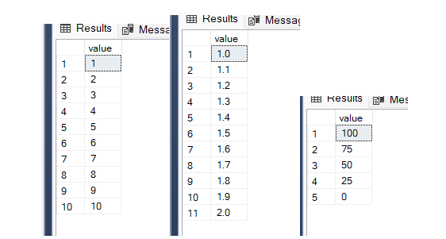
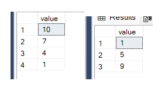
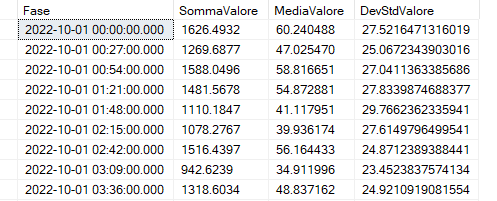
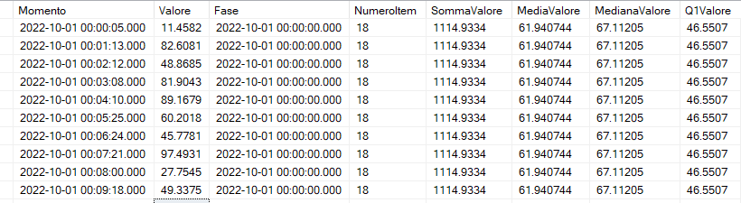
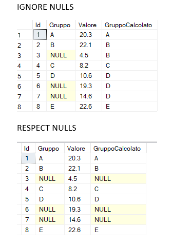

# What's new in TSQL SQL Server 2022 (ver.16)

- [What's new in TSQL SQL Server 2022 (ver.16)](#whats-new-in-tsql-sql-server-2022-ver16)
  - [GENERATE\_SERIES](#generate_series)
  - [DATE\_BUCKET](#date_bucket)
  - [FIRST\_VALUE, LAST\_VALUE (IGNORE NULLS | RESPECT NULLS)](#first_value-last_value-ignore-nulls--respect-nulls)

## GENERATE_SERIES

<https://learn.microsoft.com/en-us/sql/t-sql/functions/generate-series-transact-sql>

GENERATE_SERIES ( start , stop [ , step ] )

Generates a series of numbers within a given interval. The interval and the step between series values are defined by the user.

The parameters must be numeric and all of the same data type

``` SQL
select * from GENERATE_SERIES ( 1,10,1);

select * from GENERATE_SERIES ( 1.,2.,0.1);

select * from GENERATE_SERIES ( 100, 0,-25 );
```



``` SQL
-- if the step does not allow the final value to be reached exactly, it stops first

select * from GENERATE_SERIES ( 10, 0,-3 );
select * from GENERATE_SERIES ( 1, 11,4 );

```



## DATE_BUCKET

<https://learn.microsoft.com/en-us/sql/t-sql/functions/date-bucket-transact-sql>

DATE_BUCKET (datepart, number, date [, origin ] )

DATE_BUCKET returns the date-time value corresponding to the start of each date-time bucket from the timestamp defined by the origin parameter, or the default origin value of 1900-01-01 00:00:00.000 if the origin parameter isn't specified.

Useful to aggregate records in a custom time intervals

``` SQL

-- dati di esempio 
drop table if exists #ExampleDate;
GO

select 
 dateadd(second, 30 * RAND(CHECKSUM(NEWID())), dateadd(minute,value,'20221001')) as momento ,
 convert(numeric(6,4),100 * RAND(CHECKSUM(NEWID()))) as Valore
 into #ExampleDate
from 
 GENERATE_SERIES (0,2000,1)
;

select top 20 * from #ExampleDate order by momento;

 -- aggregazione ogni 27 minuti
SELECT
    DATE_BUCKET(MINUTE,27,momento,convert(datetime,'20221001')) as Fase,
    sum (valore) as SommaValore,
    avg(valore) as MediaValore,
    stdev(valore) as DevStdValore
  FROM #ExampleDate
  GROUP BY DATE_BUCKET(MINUTE,27,momento,convert(datetime,'20221001'))
GO
```



``` SQL

-- DATE_BUCKET e Windows Forms all'interno del bucket temporale
 SELECT 
    Momento, Valore,
    DATE_BUCKET(MINUTE,27,momento,convert(datetime,'20221001')) as Fase,
    count(valore) over (partition by DATE_BUCKET(MINUTE,27,momento),convert(datetime,'20221001')) as NumeroItem,
    sum(valore) over (partition by DATE_BUCKET(MINUTE,27,momento),convert(datetime,'20221001')) as SommaValore,
    avg (valore) over (partition by DATE_BUCKET(MINUTE,27,momento),convert(datetime,'20221001')) as MediaValore,
    PERCENTILE_CONT(.5) WITHIN GROUP (ORDER BY valore) over (partition by DATE_BUCKET(MINUTE,27,momento),convert(datetime,'20221001'))  AS MedianaValore,
    PERCENTILE_CONT(.25) WITHIN GROUP (ORDER BY valore) over (partition by DATE_BUCKET(MINUTE,27,momento),convert(datetime,'20221001'))  AS Q1Valore

FROM 
    #ExampleDate
ORDER BY
    momento
;
```



## FIRST_VALUE, LAST_VALUE (IGNORE NULLS | RESPECT NULLS)

<https://learn.microsoft.com/en-us/sql/t-sql/functions/first-value-transact-sql>
<https://learn.microsoft.com/en-us/sql/t-sql/functions/last-value-transact-sql>

FIRST_VALUE ( [scalar_expression ] )  [ IGNORE NULLS | RESPECT NULLS ]
    OVER ( [ partition_by_clause ] order_by_clause [ rows_range_clause ] )

LAST_VALUE ( [ scalar_expression ] )  [ IGNORE NULLS | RESPECT NULLS ]
    OVER ( [ partition_by_clause ] order_by_clause [ rows_range_clause ] )

Returns the first value or the last value in an ordered set of values.

IGNORE NULLS - Ignore null values in the dataset when computing the last value over a partition.
RESPECT NULLS - Respect null values in the dataset when computing last value over a partition.

``` SQL

-- example data
drop table if exists #ExampleDate;
GO


SELECT Id,Gruppo, Valore
into #ExampleDate
FROM (VALUES 
(1,'A', 20.3), (2,'B', 22.1), (3,null,4.5), (4,'C', 8.2), 
(5,'D', 10.6) ,(6,null, 19.3),(7,null, 14.6),(8,'E',22.6)
) AS t (Id,Gruppo, Valore)
;

select * from #ExampleDate;

-- IGNORE NULLS: if null the previous value is used (dragging)
select
    Id,Gruppo, Valore,
    last_value(Gruppo) IGNORE NULLS 
    over (order by Id rows between unbounded preceding and current row) as GruppoCalcolato
from 
    #ExampleDate
order by Id

-- RESPECT NULLS: if null value is not calculated
select
    Id,Gruppo, Valore,
    last_value(Gruppo) RESPECT NULLS 
    over (order by Id rows between unbounded preceding and current row) as GruppoCalcolato
from 
    #ExampleDate
order by Id
```


