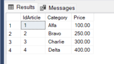
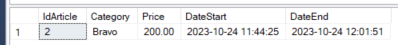
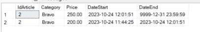
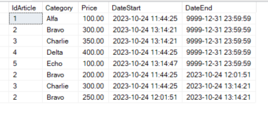
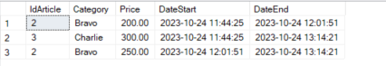

# **Temporal Table** (system-versioned temporal tables)

<https://learn.microsoft.com/en-us/sql/relational-databases/tables/temporal-tables?view=sql-server-ver16>

## Creation the temporal table

The time table must have the following requirements:

- must have a primary key
- must 2 fields of type datetime2 declared GENERATED ALWAYS AS ROW START / END
- a PERIOD SYSTEM_TIME attribute defined on the two datetime2 fields

### Initial environmental cleaning

``` SQL

IF OBJECT_ID(N'dbo.Articles', N'U') IS NOT NULL
BEGIN
 IF OBJECTPROPERTY(OBJECT_ID(N'dbo.Articles', N'U'), N'TableTemporalType') = 2
    ALTER TABLE dbo.Articles SET ( SYSTEM_VERSIONING = OFF );
 DROP TABLE IF EXISTS dbo.Articles, dbo.ArticlesHistory;
END;

```


### Table creation

``` SQL
create table dbo.Articles
(
 IdArticle int not null CONSTRAINT PK_IdArticle PRIMARY KEY NONCLUSTERED,
 Category varchar(50),
 Price numeric (8,2),

 DateStart DATETIME2(0) GENERATED ALWAYS AS ROW START HIDDEN NOT NULL, -- hidden attribute is optional 
 DateEnd   DATETIME2(0) GENERATED ALWAYS AS ROW END   HIDDEN NOT NULL, -- hidden attribute is optional 
 PERIOD FOR SYSTEM_TIME (DateStart, DateEnd),
)
WITH ( SYSTEM_VERSIONING = ON ( HISTORY_TABLE = dbo.ArticlesHistory ) ); -- the name of history table is optional. If not indicated the name of history table is generated automatically
;
GO

```

### Example of utilization

``` SQL
select * from dbo.Articles
select * from dbo.ArticlesHistory

-- Insert some data
insert into dbo.Articles
values (1,'Alfa',100),(2,'Bravo',200),(3,'Charlie',300), (4,'Delta',400);
GO

select * from dbo.Articles;
select * from dbo.ArticlesHistory; -- historical table is empty
GO

-- update record
update dbo.Articles set Price = Price + 50 where IdArticle in(2);
GO

select * from dbo.Articles;
select * from dbo.ArticlesHistory ;  -- date are stored in the UTC time zone
GO
```





```SQL

-- With for system_time all option all record actual and storical are retrieved

select *, DateStart,DateEnd 
from dbo.Articles for system_time all
where IdArticle=2
order by DateStart desc
```



```SQL

update dbo.Articles set Price = Price + 50 where IdArticle in(2,3);
GO

-- new articles
insert into dbo.Articles values (5,'Echo',100);
GO

select *, DateStart,DateEnd from dbo.Articles for system_time all

select * from dbo.ArticlesHistory -- the new article (Echo) is not present in historic table

```



the new article (Echo) is not present in historic table




### Deleting table

To delete a Temporal Table the system version must be set to off.
Data table and Historical table must be delete separately

```SQL

/* final cleanup */
IF OBJECT_ID(N'dbo.Articles', N'U') IS NOT NULL
BEGIN
 IF OBJECTPROPERTY(OBJECT_ID(N'dbo.Articles', N'U'), N'TableTemporalType') = 2
    ALTER TABLE dbo.Articles SET ( SYSTEM_VERSIONING = OFF );
 DROP TABLE IF EXISTS dbo.Articles, dbo.ArticlesHistory;
END;

```
